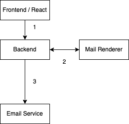

# React mail templates

This is a basic example of how to render html from react for sending emails.

This setup includes: 
- react, react-dom
- juice - for inlining css for emails
- wouter - for routing

# Why ?

You start a project and just like any modern website's architecture, you split Frontend and Backend.

Backend serves an api and Frontend completely isolated from the backend, calls api endpoints and renders on the client side.

Backend developers doesn't need to understand anything from frontend. Frontend developers doesn't really care how backend works. You develop your product, website.... Voila... Everything looks great, teams have great autonomy... And then you realize that you need to send emails.

There are several paths you can take:

## Rendering emails on backend

Backend team tries to figure out how to render and send emails. Sending email is actually a backend task right ? So they try to develop mail templates, rendering and sending on the backend side in their favorite framework. If backend rendering comes out of the box (for example in django) then they try to deal with htmls, templates etc. and hope the emails will look ok.

Next step is usually onboarding frontend developers to "django's" templating system so that they fix all the styling.

Then you find a hosted saas that gives you an api or smtp service and send mails.

Whenever your marketing team wants changes everyone in the team starts moving their eyebrows.

## Using a vendor (Rendering emails with a SAAS company)

You start seeking for an transactional email service provider (eg: sendgrid), you realize that they use some other templating language totally unrelated to your react/jsx framework https://docs.sendgrid.com/for-developers/sending-email/using-handlebars. You ask frontend developers to deal with it. They learn the language and somehow magically integrate their github flow (or their development flow) with that Saas.

## Using server-side rendering 

You use nextjs or chrome's renderer (or anything in that space) and figure out rendering react on the server side - so that frontend developers won't have to deal with different languages/frameworks.

This project is an attempt to provide some guidance for this path.


# How it works ?

React has `ReactDOMServer.renderToStaticMarkup` to render to html. So what we do is, create a react element (`React.createElement`) and then give it to renderToStaticMarkup. Get the output from there and put it in a layout.

Then `juice` will inline the css in that html. You know you can't use external css files in email templates. Juice inlines them.

We build an api endpoint around that. We get some json data and pass it as props to createElement.

So say you want to send a welcome email, after a user signs up on your website. Your backend service will handle the call, register the user and then will do a post call to this server with some contextual data.    

```
http -v POST http://mailserver:8887/mail/mail_beginner_user username=foobar
```

Get the html output from there and send it to your favorite transactional email provider.

Let's put this into a diagram.




# End of story ?

Your frontend developers can keep using react as usual for email templates too. There might even be a chance to re-use some of the components from the website/application.

Your backend developers doesn't need to know at all about all this rendering. They call an endpoint to get the rendered mail.

You can even extend this setup a bit more so that if marketing needs some changes they can do it. Maybe utilizing a CMS. 

The trade-off, you complicate your setup a bit.


# Install and run

```
npm i
```

then run api and react server with

```
npm run dev
```

You can see the rendered templates with visiting 

```
http://localhost:3000/
```

on your favorite browser.

To see api response in action 

```
$ http -v POST http://localhost:8887/mail/mail_beginner_user username=foobar
POST /mail/mail_beginner_user HTTP/1.1
Accept: application/json, */*;q=0.5
Accept-Encoding: gzip, deflate
Connection: keep-alive
Content-Length: 22
Content-Type: application/json
Host: localhost:8887
User-Agent: HTTPie/3.2.1

{
    "username": "foobar"
}


HTTP/1.1 200 OK
Cache-Control: no-cache, no-store, must-revalidate
Connection: keep-alive
Content-Length: 563
Content-Type: application/json; charset=utf-8
Date: Thu, 02 Jun 2022 22:03:53 GMT
ETag: W/"233-99nUlR2YbawhJACGyML71MFUllw"
Expires: 0
Keep-Alive: timeout=5
Pragma: no-cache
X-Powered-By: Express

{
    "html": "<!DOCTYPE html>\n  <html lang=\"en\" xmlns=\"http://www.w3.org/1999/xhtml\">\n    <head>\n      <link rel=\"stylesheet\" href=\"./App.css\">\n      \n    </head>\n    <body style=\"background-color: purple;\">\n      <table><tbody><tr><td><div class=\"header\">Hello<hr></div><div>Hello foobar, You have been using our site for the last 2 weeks. Checking if everything is allright</div><div id=\"footer\" style=\"color: #400;\">OurWebsite | Copyright | <a href=\"/\">Click here to unsubscribe</a></div></td></tr></tbody></table>\n    </body>\n  </html>"
}
```

In case you are curious about the perf. of the rendering, you can visit

```
k6 run -d 10s -u 100 loadtest.js
```

This roughly responds with 4k reqs/sec, on an unoptimized macbook air with pycharm and vscode and 100 tabs on chrome running. So should be a bit more faster on a server.

```
$ k6 run -d 10s -u 100 loadtest.js


          /\      |‾‾| /‾‾/   /‾‾/
     /\  /  \     |  |/  /   /  /
    /  \/    \    |     (   /   ‾‾\
   /          \   |  |\  \ |  (‾)  |
  / __________ \  |__| \__\ \_____/ .io

  execution: local
     script: loadtest.js
     output: -

  scenarios: (100.00%) 1 scenario, 100 max VUs, 40s max duration (incl. graceful stop):
           * default: 100 looping VUs for 10s (gracefulStop: 30s)


running (10.0s), 000/100 VUs, 40328 complete and 0 interrupted iterations
default ✓ [======================================] 100 VUs  10s

     ✓ status is 200

     checks.........................: 100.00% ✓ 40328       ✗ 0
     data_received..................: 36 MB   3.5 MB/s
     data_sent......................: 7.1 MB  712 kB/s
     http_req_blocked...............: avg=6.88µs  min=0s      med=0s      max=3.7ms    p(90)=1µs     p(95)=1µs
     http_req_connecting............: avg=4.72µs  min=0s      med=0s      max=2.28ms   p(90)=0s      p(95)=0s
     http_req_duration..............: avg=24.78ms min=16.57ms med=22.48ms max=127.07ms p(90)=30.15ms p(95)=41.39ms
       { expected_response:true }...: avg=24.78ms min=16.57ms med=22.48ms max=127.07ms p(90)=30.15ms p(95)=41.39ms
     http_req_failed................: 0.00%   ✓ 0           ✗ 40328
     http_req_receiving.............: avg=11.22µs min=7µs     med=10µs    max=917µs    p(90)=13µs    p(95)=15µs
     http_req_sending...............: avg=3.52µs  min=2µs     med=3µs     max=431µs    p(90)=4µs     p(95)=5µs
     http_req_tls_handshaking.......: avg=0s      min=0s      med=0s      max=0s       p(90)=0s      p(95)=0s
     http_req_waiting...............: avg=24.76ms min=16.56ms med=22.47ms max=127.04ms p(90)=30.13ms p(95)=41.38ms
     http_reqs......................: 40328   4023.784309/s
     iteration_duration.............: avg=24.81ms min=16.61ms med=22.51ms max=127.1ms  p(90)=30.18ms p(95)=41.43ms
     iterations.....................: 40328   4023.784309/s
     vus............................: 100     min=100       max=100
     vus_max........................: 100     min=100       max=100

```
